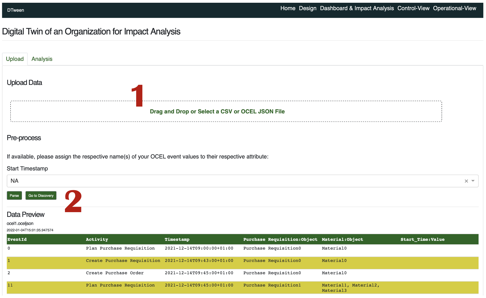

# Tool manual - IMPACTA

[](https://www.youtube.com/watch?v=J-3vyUlQq78 "IMPACTA DEMO VIDEO")

*IMPACTA* is an interactive tool implementing digital twins of organizations supporting impact analysis of changes in Process-Aware Information Systems (PAIS). 

# User Manual

## 1. **Designing Digital Twin Interface Models (DT-IMs)**

We first need to design DT-IMs based on event data and user inputs. 

### 1.1. Input and output (see Appendix for details)

- Input: OCEL, guards, valves, activity variants
- output: Digitalt Twin Interface Model (DT-IM)

### 1.2. How to

- Go to **Home**. As shown below, 1) Import OCEL JSON and 2) Preview the data and parse it.
    
    
    
- Go to **Design**. As shown below, 1) discover an OCPN, 2) upload valves, 3) upload guards, and 4) upload activity variants, and 5) connect to the target information system. You can see the discovered OCPN, uploaded valves, uploaded guards, and uploaded activity variants in the same page.
    
    
    
- As shown below, 1) apply valves, 2) apply guards, and 3) apply activity variants to enhance the discovered OCPN and produce an DT-IM.
    
    
    

## 2. Synchronizing to the target information system and updating control/operational views of DT-IM.

Next, we enhance the DT-IM discovered in the previous step to the target information system by synchronizing current configurations (hence updating control views) and importing streaming event data (hence updating operational views).

### 2.1. Input and Output

- Input:
    - user inputs
    - DT-IM
- Output
    - DT-IM enhanced with up-to-date control/operational views

### 2.2. How to

- Go to **Dashboard & Impact Analysis** and click Sync To Information System to synchronize the DT-IM with the target information system. The synchronization is based on the connection to the target system done in the previous step.
- Go to Control-View, and you can see the current configuration, i.e., 1) current valve settings and 2) activity variant settings with 3) the DT-IM.
    
    
    
- Go to Operational-View, and you can see the current operational states, i.e., 1) marking, 2) object value mapping, and 3) diagnostics as below. By clicking a place, you can see the marking of the place. The diagnostics are provided by selecting the analysis period and types of diagnostics.
    
    
    
    
    

## 3. Defining Actions

To analyze the impact of changes incurred by actions, we design actions. An action consists of 1) changes in valves and 2) changes activity variants.

### 3.1. Input and Output

- Input
    - User inputs
    - DT-IM
- Output
    - Action defined over DT-IM (Python Object)

### 3.2. How to

- Go to Action Definition. As shown below, 1) specify action name, 2) define valve changes by adjusting knots, and 3) define activity variant changes by choosing activity variants.
    
    
    

## 4. Designing Action Instances

Based on the action definitions, we design action instances by specifying which actions will be applied to the target information system and how long they will be effective.

### 4.1. Input and Output

- Input
    - User inputs
    - DT-IM
- Output
    - Action Instance defined over DT-IM (Python Object)

### 4.2. How to

- Go to **Dashboard & Impact Analysis**. As shown below, 1) select an action, 2) specify the start and end time of executing the action, and 3) add an action instance. The timeline shows the overview of defined action instances.
    
    
    

## 5. Impact Analysis

At the start time of the action instance, we analyze pre-action impacts with multiple impact measures. At the end time of the action instance, we analyze post-action impacts with multiple impact measures. 

The impact analysis aims to analyze the impact of the action instance by continuously evaluating the streaming event data from the target information system. To ease the introduction of its functionality, we use the simulation of the target information system that we can flexibly control, i.e., start it and forward it whenever we want to evaluate an action instance.

### 5.1. Input and Output

- Input
    - Streaming event data
    - DT-IM
- Output
    - pre/post-action impact scores

### 5.2. How to

- As shown below, specify 1) the simulation step size (i.e., how much time of the reality each step will represent) and 2) the number of simulation steps (i.e., how many simulation steps we will use) Afterward, you can control the simulation by 3) starting the simulation of the target information system and 4) moving forward each step.
    
    
    
- As shown below, 1) the vertical line in the timeline represents the progress of the simulation.  Once an action instance has been effective, we can 2) click the action instance in the timeline to see the pre-action impact scores as below. Moreover, by clicking the green box, we can analyze the impacted entities. Once an action instance is finished, we can click the action instance in the timeline to see the post-action impact scores as below.
    
    
    

## Deployment

### Manual

Please make sure to install the binaries of [Graphviz](https://graphviz.org/) and [Python 3.8.3](https://www.python.org/downloads/release/python-383/) before you proceed. In the following, shell scripts are developed for the zsh, so if you use a different shell, then you need to modify the scripts accordingly.

In the first shell:

```bash
git clone https://github.com/gyunamister/impacta.git
git clone https://github.com/gyunamister/ocpa.git
cd impacta/src/backend/db
docker-compose up
```

In the second shell:

```bash
export DTWEEN_PATH=<path_to_your_impacta_root> # impacta/
export OCPA_PATH=<path_to_your_ocpa_root> # ocpa/
cd impacta/src/backend
chmod +x ./run_celery.sh
./run_celery.sh
```

Alternatives to Windows:

```bash
pip install eventlet  
set REDIS_LOCALHOST_OR_DOCKER=localhost
set RABBIT_LOCALHOST_OR_DOCKER=localhost
set RABBITMQ_USER=dtween
set RABBITMQ_PASSWORD=dtween92! 
cd src/server/backend/tasks
celery -A tasks worker --loglevel=INFO -P eventlet
```

In the third shell:

```bash
export DTWEEN_PATH=<path_to_your_impacta_root> # impacta/
export OCPA_PATH=<path_to_your_ocpa_root> # ocpa/
cd impacta/src/backend
chmod +x ./run_dtween.sh
./run_dtween.sh
```

The default username is admin, and the default password is test123 for logging into the system available at 127.0.0.1/8051.

### Automatic

TBD

## Target information system

To facilitate the test of the tool, we provide an experimental environment with an information system supporting a Purchase-To-Pay(P2P) process.

### Description of Purchase-To-Pay Process

Below is the process model describing the P2P process in OCPN formalism:


- 24 resources are available with different business hours, each of them being responsible for multiple activities in the process.
- Orders are randomly placed and the resources process the orders and the corresponding items and routes based on First-in-First-out rule.

## Appendix 1: Input and Output

- OCEL: [standard OCEL format](http://ocel-standard.org/)
    - Example:
        
        ```json
        {
            "ocel:global-event": {
                "ocel:activity": "__INVALID__"
            },
            "ocel:global-object": {
                "ocel:type": "__INVALID__"
            },
            "ocel:global-log": {
                "ocel:attribute-names": [
                    "type",
                    "price"
                ],
                "ocel:object-types": [
                    "order",
                    "item",
                    "route"
                ],
                "ocel:version": "1.0",
                "ocel:ordering": "timestamp"
            },
            "ocel:events": {
                "1c8428e6-3ad8-44f0-b0a6-76027ddd6fe6": {
                    "ocel:activity": "place_order",
                    "ocel:timestamp": "2021-06-01 17:54:02",
                    "ocel:omap": [
                        "o0",
                        "i0a",
                        "i0b"
                    ],
                    "ocel:vmap": {
                        "resource": "po_machine"
                    }
                },
        				...
        		},
        		"ocel:objects": {
                "o0": {
                    "ocel:type": "order",
                    "ocel:ovmap": {
                        "price": 231
                    }
                },
        				...
        		}
        }
        ```
        
- guards: JSON-based format
    - Example
    
    ```json
    {
        "guards": [
            {
                "transition": "Create Purchase Requisition",
                "guard": "[Material.planned_delivery_days >= {min_planned_delivery_days}]"
            },
            {
                "transition": "Create Purchase Order",
                "guard": "[Material.net_price - Material.effective_price <= {max_price_diff}, Material.quantity >= {min_order_quantity}]"
            },
            ...
        ]
    }
    ```
    
- valves: JSON-based format
    - Example
    
    ```json
    {
        "valves": {
            "min_planned_delivery_days": {
                "r_min": 0,
                "r_max": 100,
                "default": 5
            },
            "max_price_diff": {
                "r_min": 100,
                "r_max": 1000,
                "default": 200
            },
            "min_order_quantity": {
                "r_min": 0,
                "r_max": 100,
                "default": 5
            },
    				...
        }
    }
    ```
    
- Output:
    - Digital Twin Interface Model: Python object
- system information: JSON-based format
    - Example
        
        ```json
        {
            "dir-event-stream": "<path-to-event-stream>",
            "dir-system-config": "<path-to-system-configuration>"
        }
        ```
        
        The event stream must be in OCEL: [standard OCEL format](http://ocel-standard.org/). The system configuration is JSON-based format.
