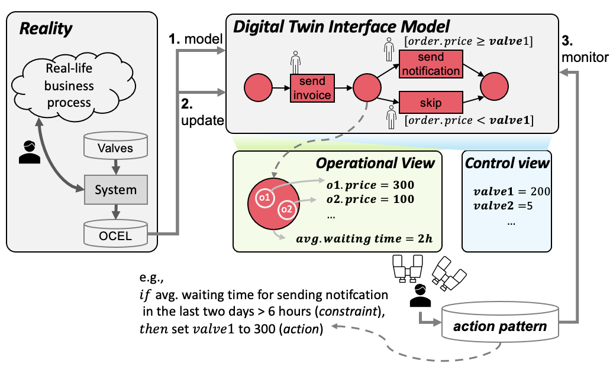

# Tool manual - DTWEEN

*Dtween* is an interactive tool for action-oriented process mining based on digital twins. The digital twin provides a user-friendly interface to ERP systems that support business processes. 

To this end, it provides two views: *control view* and *operational view*. The control view describes the routing/resource allocation rules of business processes, while specifying possible configurations over the information system supporting the process. The operational view represents the current state of the process based on the marking of object-centric Petri nets and various diagnostics computed using event data from the system.

By communicating with the digital twin, users can define action patterns which define a condition describing an undesired situation and an action to resolve the situation. *Dtween* monitors the action patterns by analyzing streaming event data and produces necessary actions.



# Functionalities

## 1. Building digital twins

### 1.1. Input and output

- Input: OCEL, guards, valves
    - OCEL: [standard OCEL format](http://ocel-standard.org/)
        - Example:

            ```json
            {
                "ocel:global-event": {
                    "ocel:activity": "__INVALID__"
                },
                "ocel:global-object": {
                    "ocel:type": "__INVALID__"
                },
                "ocel:global-log": {
                    "ocel:attribute-names": [
                        "type",
                        "price"
                    ],
                    "ocel:object-types": [
                        "order",
                        "item",
                        "route"
                    ],
                    "ocel:version": "1.0",
                    "ocel:ordering": "timestamp"
                },
                "ocel:events": {
                    "1c8428e6-3ad8-44f0-b0a6-76027ddd6fe6": {
                        "ocel:activity": "place_order",
                        "ocel:timestamp": "2021-06-01 17:54:02",
                        "ocel:omap": [
                            "o0",
                            "i0a",
                            "i0b"
                        ],
                        "ocel:vmap": {
                            "resource": "po_machine"
                        }
                    },
            				...
            		},
            		"ocel:objects": {
                    "o0": {
                        "ocel:type": "order",
                        "ocel:ovmap": {
                            "price": 231
                        }
                    },
            				...
            		}
            }
            ```

    - guards: JSON-based format
        - Example

        ```json
        {
            "guards": [
                {
                    "transition": "place_order",
                    "guard": "[order.price >= po-price]"
                },
                {
                    "transition": "send_notification",
                    "guard": "[order.price >= sn-price]"
                },
                {
                    "transition": "skip_send_notification",
                    "guard": "[order.price < sn-price]"
                },
                {
                    "transition": "check_availability",
                    "guard": "[item.quantity >= caw-qty]"
                },
                {
                    "transition": "check_availability_with_approval",
                    "guard": "[item.quantity < caw-qty]"
                }
            ]
        }
        ```

    - valves: JSON-based format
        - Example

        ```json
        {
            "valves": {
                "po-price": {
                    "r_min": 0,
                    "r_max": 100,
                    "default": 5
                },
                "sn-price": {
                    "r_min": 100,
                    "r_max": 1000,
                    "default": 200
                },
                "caw-qty": {
                    "r_min": 0,
                    "r_max": 100,
                    "default": 10
                }
            }
        }
        ```

- Output:
    - digital twin: Python object

### 1.2. **Importing OCELs and parsing it**


1. Import OCEL JSON or CSV files
2. Select attributes
3. Preview the data and parse it

### 1.3. **Discovering an OCPN, annotating guards and valves**


1. Discovering an OCPN
2. Uploading JSON-based guards
3. Uploading JSON-based valves
4. Applying guards to the discovered OCPN

## 2. Updating states of digital twins

### 2.1. Input and Output

- Input:
    - streaming OCEL: [standard OCEL format](http://ocel-standard.org/)
    - digital twin: Python object
- Output
    - A state of the digital twin: Python object

### 2.2. Offline analysis


1. Selecting time window for analysis
2. Showing diagnostics

### 2.3. Online updates


1. Connecting to an event stream
2. Setting the size of the sliding window
3. Setting the step size of the window
4. Controlling updates (start, stop, reset)

## 3. Defining action patterns

### 3.1. Input and Output

- Input
    - User inputs to define conditions (e.g., diagnostics, comparator, threshold, and name)
    - User inputs to define actions (e.g., valve, value, and name)
    - User inputs to define action patterns (e.g., mapping between conditions and actions, name)
- Output
    - Action patterns: Python object

### 3.2. Defining conditions


1. Selecting types of diagnostics (e.g., waiting time) to be used to formulate a condition
2. Selecting comparator (e.g., >,=,<) to be used to formulate a condition
3. Selecting threshold value (e.g., 10, 0.8) to be used to formulate a condition
4. Naming the condition 
5. Defining the condition with the current inputs

### 3.3. Defining actions


1. Selecting a valve to be used to define an action
2. Selecting values of the selected valve to define an action
3. Naming the action
4. Defining the action with the current inputs

### 3.4. Defining action patterns


1. Selecting conditions to be used to formulate an action pattern
2. Selecting actions to be used to formulate an action pattern
3. Naming the action pattern
4. Adding patterns to the system, as shown below as a graph

## 4. Action engine

### 4.1. Input and Output

- Input
    - Action patterns: Python object
    - States of the digital twin: Python object
    - Configurations of the digital twin: Python object
- Ouptut
    - Actions: Python object

### 4.2. Evaluating action patterns and generating actions


1. While updating the states of the digital twin, the action patterns are also evaluated generating actions accordingly.

## Deployment

### Manual

Please make sure to install the binaries of [Graphviz](https://graphviz.org/) and [Python 3.8.3](https://www.python.org/downloads/release/python-383/) before you proceed. In the following, shell scripts are developed for the zsh, so if you use a different shell, then you need to modify the scripts accordingly.

In the first shell:

```bash
pip install -e .
cd src/backend/db
docker-compose up
```

In the second shell:

```bash
export DTWEEN_PATH=<path_to_your_project_root> # the directory where src/ is located
cd src/backend
chmod +x ./run_celery.sh
./run_celery.sh
```

Alternatives to Windows:

```bash
pip install eventlet  
set REDIS_LOCALHOST_OR_DOCKER=localhost
set RABBIT_LOCALHOST_OR_DOCKER=localhost
set RABBITMQ_USER=contect
set RABBITMQ_PASSWORD=contect191! 
cd src/server/backend/tasks
celery -A tasks worker --loglevel=INFO -P eventlet
```

In the third shell:

```bash
export DTWEEN_PATH=<path_to_your_project_root> # the directory where src/ is located
cd src/backend
chmod +x ./run_dtween.sh
./run_dtween.sh
```

The default username is admin, and the default password is test123 for logging into the system available at 127.0.0.1/8050.

### Automatic

## Artificial information system

To facilitate the test of the tool, we provide an experimental environment with an information system simulating an order handling process.

### Process

Below is the process model describing the order handling process in OCPN formalism:


14 resources are available in total at any point in time, each of them being responsible for multiple activities in the process. Orders are randomly placed and the resources process the orders and the corresponding items and routes based on First-in-First-out rule.

### Configuration

Multiple configurations are available in the information system. For instance, *sn-price* determines the minimum price of the orders that require the notification for payments. Moreover, *caw-price* determines the minimum quantities of the items requiring approvals for checking availability. The information system generates event logs recording the execution of the process in OCEL format.

### Implementation

The information system is implemented using [Simpy](https://simpy.readthedocs.io/en/latest/index.html), discrete simulation framework based on standard Python.
