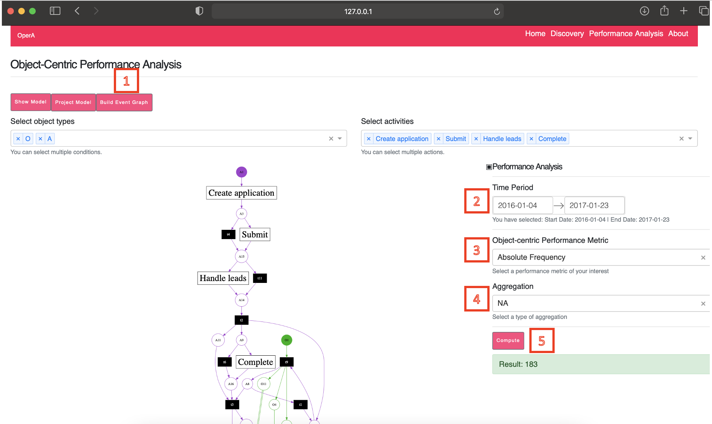
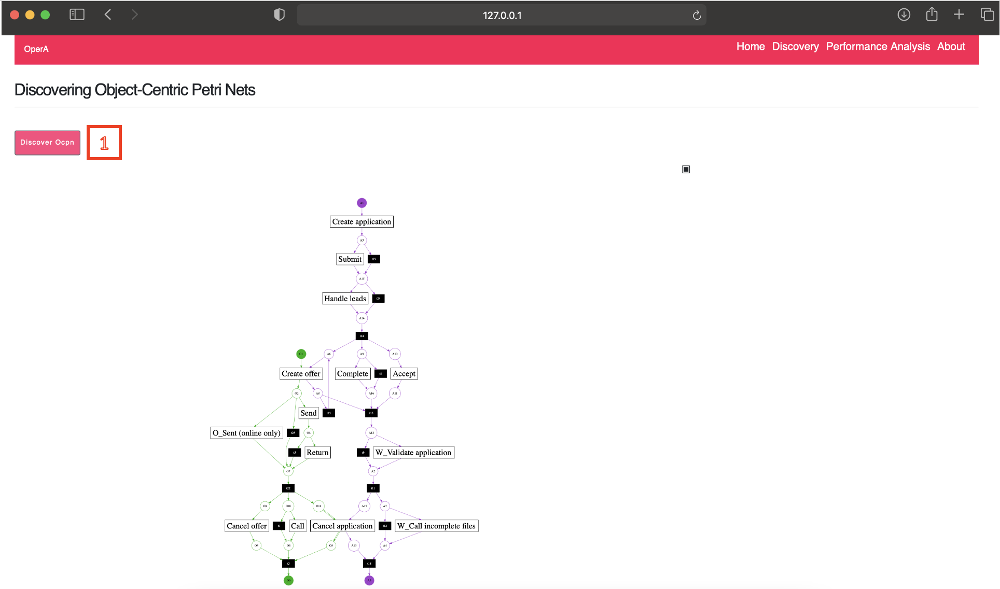
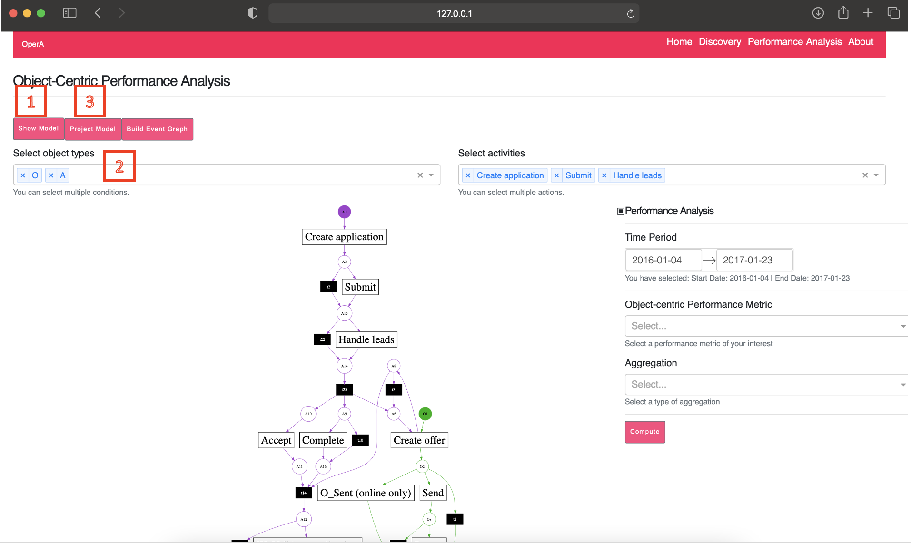
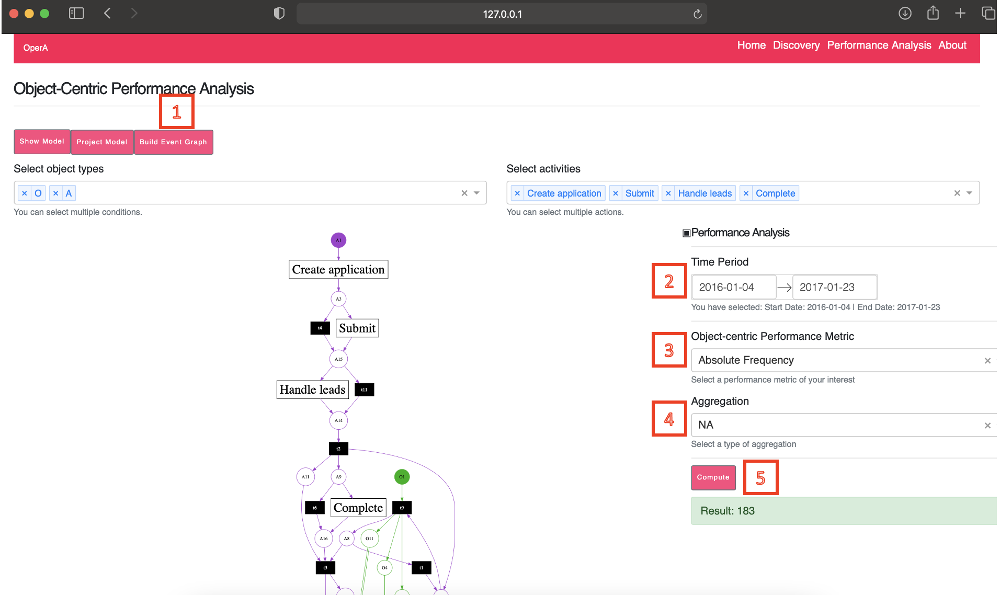

# Tool manual - OPerA

*OperA* is an interactive tool implementing object-centric performance analysis. 
It supports:
- Importing of object-centric event logs in different formats including OCEL JSON, OCEL XML, and CSV.
- Discovering object-centric Petri nets based on Inductive Miner Directly-Follows process discovery algorithm.
- Visualizing object-centric Petri nets to define different analysis views and analyze the performance.
- Projecting object-centric Petri nets based on analysis views.
- Filtering object-centric event logs based on analysis views. 
- Computing various performance measures.


# Functionalities

## 1. Importing

### 1.1. Input and output



1. Import OCEL JSON or CSV files
2. Select attributes
3. Preview the data and parse it

## 2. Discovering object-centric Petri nets



1. Discover an OCPN

## 3. Projecting object-centric Petri nets



1. Show the discovered OCPN
2. Define an analysis view (By clicking transitions, you can add activities.)
3. Project the discoverd OCPN on the analysis view

## 4. Computing performance measures



1. Build event object graphs 
2. Select time period
3. Select performance metric
4. Select aggregation 
5. Compute performance measure 

## Deployment

### Manual

Please make sure to install the binaries of [Graphviz](https://graphviz.org/) and [Python 3.8.8](https://www.python.org/downloads/release/python-383/) before you proceed. In the following, shell scripts are developed for the zsh, so if you use a different shell, then you need to modify the scripts accordingly.

In the first shell:

```bash
git clone https://github.com/gyunamister/OPerA.git
cd src/backend/db
docker-compose up
```

In the second shell:

```bash
export OPERA_PATH=<path_to_your_project_root> # the directory where src/ is located
cd src/backend
chmod +x ./run_celery.sh
./run_celery.sh
```

Alternatives to Windows:

```bash
pip install eventlet  
set REDIS_LOCALHOST_OR_DOCKER=localhost
set RABBIT_LOCALHOST_OR_DOCKER=localhost
set RABBITMQ_USER=opera
set RABBITMQ_PASSWORD=opera92! 
cd src/server/backend/tasks
celery -A tasks worker --loglevel=INFO -P eventlet
```

In the third shell:

```bash
export OPERA_PATH=<path_to_your_project_root> # the directory where src/ is located
cd src/backend
chmod +x ./run_opera.sh
./run_opera.sh
```

The default username is admin, and the default password is test123 for logging into the system available at 127.0.0.1/8050.

### Automatic

TBD
