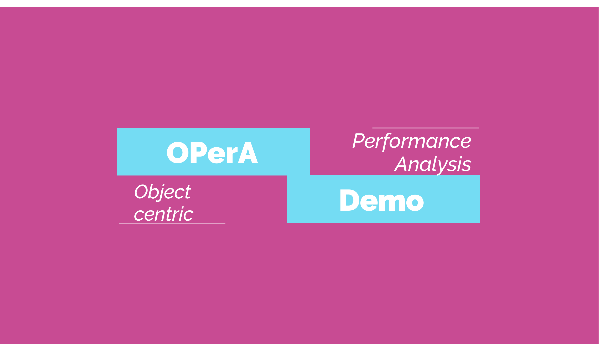

# OPerA

*OperA* is an interactive tool implementing object-centric performance analysis. 
It supports:
- Importing object-centric event logs in different formats including OCEL JSON, OCEL XML, and CSV.
- Discovering Object-Centric Petri Nets (OCPNs) based on the general approach (van der Aalst and Berti, 2020) Inductive Miner Directly-Follows process discovery algorithm (Leemans, 2018).
    - van der Aalst, W.M.P., Berti, A.: Discovering object-centric Petri nets. Fundam.Informaticae 175(1-4), 1–40 (2020)
    - Leemans, S.J.J., Fahland, D., van der Aalst, W.M.P.: Scalable process discovery and conformance checking. Softw. Syst. Model. 17(2), 599–631 (2018)
- Replaying tokens with timestamps on OCPNs based on the token-based replay approach (Berti and van der Aalst, 2021).
    - Berti, A., van der Aalst, W.M.P.: A novel token-based replay technique to speed up conformance checking and process enhancement. Trans. Petri Nets Other Model. Concurr. 15, 1–26 (2021)
- Computing object-centric performance measures based on the replay results, i.e., event occurrences and token visits.
- Visualizing OCPNs with the object-centric performance measure.

# Demo Video
[](https://youtu.be/Se1vZSD9gxY "OPerA DEMO VIDEO")

# Deployment

### Automatic
For automatic and platform-independent deployment, simply execute the following commands:
```shell script
git clone https://github.com/gyunamister/OPerA.git
cd src/
docker-compose up
```
After installations, the web service is available at *127.0.0.1/8050*. 
The default username is *admin*, and the default password is *test123* for logging into the system.
If you would like the Dash web service to run in debug mode, then change the value of the environment variable **DEBUG_MODE** in the [env file](src/.env) to **true**.

Example logs are available at [examples](examples/).

### Manual

Please make sure to install the binaries of [Graphviz](https://graphviz.org/) and [Python 3.8.8](https://www.python.org/downloads/release/python-383/) before you proceed. In the following, shell scripts are developed for the zsh, so if you use a different shell, then you need to modify the scripts accordingly.

In the first shell:

```bash
git clone https://github.com/gyunamister/OPerA.git
cd src/backend/db
docker-compose up
```

In the second shell:

```bash
export OPERA_PATH=<path_to_your_project_root> # the directory where src/ is located
cd src/backend
./run_celery.sh
```

Alternatives to Windows:

```bash
pip install eventlet  
set REDIS_LOCALHOST_OR_DOCKER=localhost
set RABBIT_LOCALHOST_OR_DOCKER=localhost
set RABBITMQ_USER=opera
set RABBITMQ_PASSWORD=opera92! 
cd src/backend/tasks
celery -A tasks worker --loglevel=INFO -P eventlet
```

In the third shell:

```bash
export OPERA_PATH=<path_to_your_project_root> # the directory where src/ is located
cd src/backend
./run_opera.sh
```

The default username is admin, and the default password is test123 for logging into the system available at 127.0.0.1/8050.
